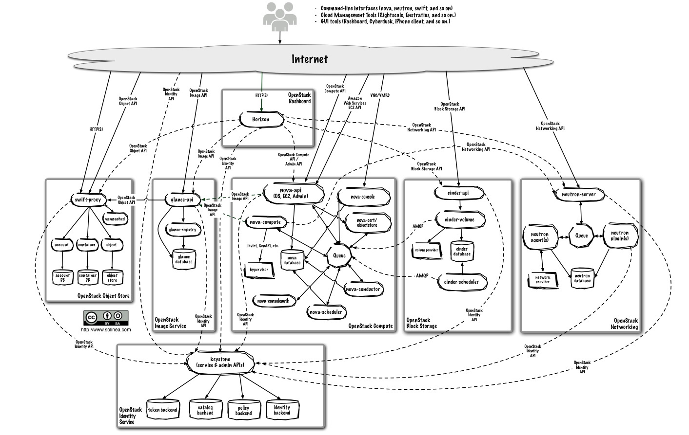
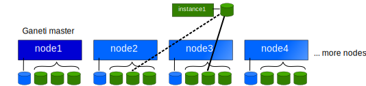
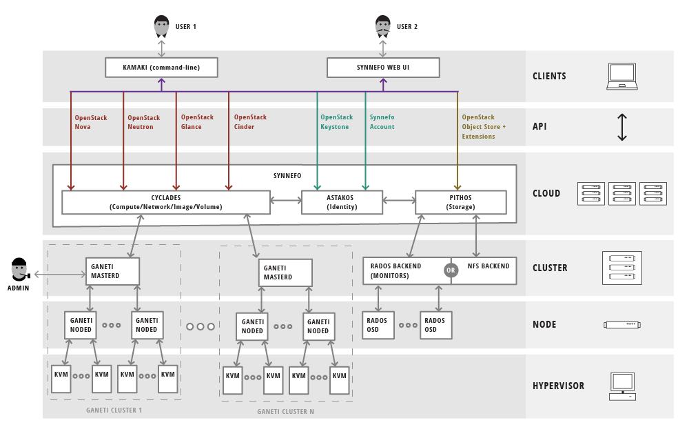

OpenStack vs. Ganeti
====================

* Lance Albertson
* Director, OSU Open Source Lab
* http://osuosl.org
* @ramereth

*Attribution-ShareAlike CC BY-SA ©2015-2016*

About me
--------
* Lance Albertson
* Director, OSU Open Source Lab (OSUOSL)

  * Provide infrastructure hosting for FOSS projects
  * Linux Foundation, Python Software Foundation, Drupal, etc

* Ops guy
* Ganeti user since 2009
* OpenStack user since 2013
* http://osuosl.org

Session Overview
----------------
* Cloud computing overview
* OpenStack quick overview
* Ganeti overview
* Ganeti walk-through
* Comparing both

Cloud Computing Resources
-------------------------
* Each organization has different needs
* Some are small and simple
* Others are more complex and larger
* Cost is also a major factor (both in licenses and staff maintenence)

Typical Solutions
-----------------
* VMWare
* oVirt
* Apache CloudStack
* OpenStack
* Public cloud (AWS, Linode, etc)
* [insert favorite solution]

Cloud Computing Use Case
------------------------
* Small web infrastructure
* Highly dynamic micro-services based
* Build & Testing compute resources
* Long running vms vs. short lived vms
* Users of the system

OpenStack is all the hype
-------------------------
* Designed to scale and be an AWS replacement (almost)
* Everyone is investing in it
* Still maturing as a project
* Includes a wide-array of features, many of which most people don't need
  initially

OpenStack Overview
------------------

OpenStack Pros
--------------
* Standard Cloud API
* Fast VM deployment and tear down
* Very elastic computing needs
* Large community support
* Quickly growing and new features added frequently

OpenStack Cons
--------------
* Extremely difficult to deploy and maintain
* Lots of moving parts
* Project is still maturing and unstable in some areas
* Fits a somewhat very specific use-case
* Requires more than one machine to use effectively
* Upgrades are ... a pain

So what about Ganeti?
=====================

First off, what is Ganeti?
--------------------------
* Cluster management tool for virtual compute resources
* IaaS solution that uses either KVM or Xen hypervisors
* Provides fast and simple recovery from hardware failures
* Primarily CLI driven, sysadmin focused
* Supports live migration cluster re-balancing
* Uses a simple architecture with minimal moving parts

What isn't Ganeti?
-------------------
* Not an entire cloud-platform by itself (primarily only provides compute)
* Doesn't provide object/image storage by default
* Not meant to be directly interfaced with users

Ganeti Overview
---------------

Project Background
------------------
* Google funded project
* Used widely internally at Google
* Active an welcoming community, mailing list and IRC
* Started before libvirt/OpenStack
* Primarily written in Python / Haskell
* No central relational database
* Annual GanetiCon

Ganeti Goals
------------
**Low Entry Level**

  - Easy to install, manage and upgrade
  - Architecture is fairly easy to understand

**Enterprise Scale**

  - Manage 1 to 200 within a single cluster

**Open Source Citizen**

  - Design and code discussions are open to the community
  - Welcome third-party projects

Architecture
------------

* Clusters are comprised of nodes, one of which is master
* Nodes can be split up into logical groups
* Instances (guests) run on nodes

Ganeti Design
-------------

Ganeti Daemons
--------------

.. csv-table::
  :widths: 5,10

  ``ganeti-noded``, "Controls the manipulation of this node’s hardware
  resources; it runs on all nodes which are in a cluster"
  ``ganeti-confd``, "Daemon used to answer queries related to the configuration
  of a Ganeti cluster. Runs on all nodes, but is only functional on master
  candidate nodes"
  ``ganeti-rapi``, "Daemon which runs on the master node and offers an
  HTTP-based API for the cluster"
  ``ganeti-masterd``, "Daemon which runs on the master node and allows control
  of the clusterdaemon which runs on the master node and allows control of the
  cluster"

Ganeti Terminology
------------------
.. csv-table::
  :widths: 5,10

  **Node**, Virtualization host
  **Instance**, Virtual Machine Guest
  **Cluster**, "Set of nodes, managed as a collective"
  **Node Group**, "homogeneous set of nodes (i.e. rack of nodes)"
  **Job**, Ganeti operation

Storage in Ganeti
-----------------
* Disk templates
* LVM, DRBD
* RBD
* File (both local and shared via NFS)
* External storage provider for SAN's
* Designed to be flexible

Deploying instances on Ganeti
-----------------------------
* Basically uses bash scripts to install the OS on the block device
* Image based via ganeti-instance-image or snf-image
* Other OS providers that use tools such as debootstrap for Debian-based hosts
* Storage backend of the VM makes things a little complicated
* No cloud-init support (but I've added simple support in instance-image)

Primary & Secondary Concepts
-----------------------------

* Instances always run on primary node
* Uses secondary node for replication when using DRBD template
* Also works with RBD, ext and shared file templates

Ganeti Walk-through
-------------------

.. rst-class:: codeblock-sm

.. code-block:: console

  root@node1:~# gnt-node list
  Node              DTotal DFree MTotal MNode MFree Pinst Sinst
  node1.example.org  26.0G 25.5G   744M  186M  587M     0     0
  node2.example.org  26.0G 25.5G   744M  116M  650M     0     0

  root@node1:~# gnt-os list
  Name
  image+cirros
  image+default

  root@node1:~# gnt-instance add -n node1 -o image+cirros -t plain -s 1G \
    --no-start instance1
  Thu Jun  7 06:05:58 2015 * disk 0, vg ganeti, name 780af428-3942-4fa9-8307-1323de416519.disk0
  Thu Jun  7 06:05:58 2015 * creating instance disks...
  Thu Jun  7 06:05:58 2015 adding instance instance1.example.org to cluster config
  Thu Jun  7 06:05:58 2015  - INFO: Waiting for instance instance1.example.org to sync disks.
  Thu Jun  7 06:05:58 2015  - INFO: Instance instance1.example.org's disks are in sync.
  Thu Jun  7 06:05:58 2015 * running the instance OS create scripts...

  root@node1:~# gnt-instance list
  Instance              Hypervisor OS           Primary_node      Status     Memory
  instance1.example.org kvm        image+cirros node1.example.org ADMIN_down      -

Ganeti Walk-through (Instance Info)
-----------------------------------

.. rst-class:: codeblock-sm

.. code-block:: console

  root@node1:~# gnt-instance info instance1
  Instance name: instance1.example.org
  UUID: bb87da5b-05f9-4dd6-9bc9-48592c1e091f
  Serial number: 1
  Creation time: 2015-06-07 06:05:58
  Modification time: 2015-06-07 06:05:58
  State: configured to be down, actual state is down
    Nodes:
      - primary: node1.example.org
      - secondaries:
    Operating system: image+cirros
    Allocated network port: 11000
    Hypervisor: kvm
      - console connection: vnc to node1.example.org:11000 (display 5100)
  …
  Hardware:
      - VCPUs: 1
      - memory: 128MiB
      - NICs:
        - nic/0: MAC: aa:00:00:dd:ac:db, IP: None, mode: bridged, link: br0
    Disk template: plain
    Disks:
      - disk/0: lvm, size 1.0G
        access mode: rw
        logical_id:  ganeti/780af428-3942-4fa9-8307-1323de416519.disk0
        on primary:  /dev/ganeti/780af428-3942-4fa9-8307-1323de416519.disk0 (252:1)

Ganeti Walk-through (Converting disk template)
----------------------------------------------

.. rst-class:: codeblock-sm

.. code-block:: console

  root@node1:~# gnt-instance shutdown instance1
  Waiting for job 11 for instance1.example.org ...

  root@node1:~# gnt-instance modify -t drbd -n node2 instance1
  Thu Jun  7 06:09:07 2015 Converting template to drbd
  Thu Jun  7 06:09:08 2015 Creating additional volumes...
  Thu Jun  7 06:09:08 2015 Renaming original volumes...
  Thu Jun  7 06:09:08 2015 Initializing DRBD devices...
  Thu Jun  7 06:09:09 2015  - INFO: Waiting for instance instance1.example.org to sync disks.
  Thu Jun  7 06:09:11 2015  - INFO: - device disk/0:  5.10% done, 20s remaining (estimated)
  Thu Jun  7 06:09:31 2015  - INFO: - device disk/0: 86.00% done, 3s remaining (estimated)
  Thu Jun  7 06:09:34 2015  - INFO: - device disk/0: 98.10% done, 0s remaining (estimated)
  Thu Jun  7 06:09:34 2015  - INFO: Instance instance1.example.org's disks are in sync.
  Modified instance instance1
   - disk_template -> drbd
  Please don't forget that most parameters take effect only at the next start of the instance.

Ganeti Walk-through (Live migration)
------------------------------------

.. rst-class:: codeblock-sm

.. code-block:: console

  root@node1:~# gnt-instance start instance1
  Waiting for job 14 for instance1.example.org …

  root@node1:~# gnt-instance migrate -f instance1
  Thu Jun  7 06:10:38 2015 Migrating instance instance1.example.org
  Thu Jun  7 06:10:38 2015 * checking disk consistency between source and target
  Thu Jun  7 06:10:38 2015 * switching node node1.example.org to secondary mode
  Thu Jun  7 06:10:38 2015 * changing into standalone mode
  Thu Jun  7 06:10:38 2015 * changing disks into dual-master mode
  Thu Jun  7 06:10:39 2015 * wait until resync is done
  Thu Jun  7 06:10:39 2015 * preparing node1.example.org to accept the instance
  Thu Jun  7 06:10:39 2015 * migrating instance to node1.example.org
  Thu Jun  7 06:10:44 2015 * switching node node2.example.org to secondary mode
  Thu Jun  7 06:10:44 2015 * wait until resync is done
  Thu Jun  7 06:10:44 2015 * changing into standalone mode
  Thu Jun  7 06:10:45 2015 * changing disks into single-master mode
  Thu Jun  7 06:10:46 2015 * wait until resync is done
  Thu Jun  7 06:10:46 2015 * done

Common Use Cases for Ganeti
---------------------------
* Cheap, stable and reliable virtual compute resources
* Hosting web sites and other misc services in a private
* Useful for hosting "pet" virtual machines
* Need a highly reliable IaaS
* Small to medium size organizations with few sysadmins

Ganeti Pros
-----------
* Architecture is fairly easy to deploy and understand
* Requires a minimal staff to maintain and upgrade
* Scales well for small/medium organization needs
* Highly customizable backend
* Built-in redundancy
* It just works!

Ganeti Cons
-----------
* No GUI frontend by default (third party projects do have some)
* API isn't very cloud compatible
* API not intended to be open to general users of the platform
* Management becomes slower the larger the cluster gets (although, its
  improving)

Ganeti + Synnefo = Ganeti+OpenStack APIs
----------------------------------------

*Synnefo is a complete open source IaaS cloud stack written in Python that
provides Compute, Network, Image, Volume and Object Storage services*

https://www.synnefo.org

* Manages multiple Ganeti clusters
* Provides API/Accounting/Quota/Block/Object storage
* Written in Python by GRNET
* Transforms Ganeti into an OpenStack/AWS-like platform

Synnefo Architecture
--------------------

Synnefo Components
------------------
.. csv-table::

  **Astakos**, Identity/Account/Quota services
  **Pithos**, Object Storage service
  **Cyclades**, Compute/Network/Image/Volume services
  **kamaki**, Command-line client
  **Synnefo Web UI**, Django web frontend

Synnefo Detailed Architecture
-----------------------------

Synnefo Screenshots
-------------------

Synnefo Screenshots
-------------------

How the OSL is using Ganeti
---------------------------
* Hosting all of the "Pet" VMs we still need
* Project specific VM(s)
* Mix of shared web infrastructure (load balancers, web frontends, backend
  services)
* OpenStack controller node (yes!)
* Whenever we want to host something that needs to have high reliability

How the OSL is using OpenStack
------------------------------
* Two clusters: OSL-internal x86 / Public POWER8 based
* OSL-internal

  * Chef cookbook integration testing
  * Developer staging/development VMs
  * Multi-node testing

* POWER8

  * FOSS project ppc64/ppc64le porting efforts
  * POWER8 software testing

OpenStack / Ganeti side-by-side
-------------------------------
**OpenStack:**

* Pro: Great for quickly creating test vms for integration testing
* Con: Extremely complicated to setup and maintain

**Ganeti:**

* Pro: Extremely fault tolerant and stable VM hosting and easy to use/maintain
* Con: Doesn't scale well for cloud-specific needs

Future plans
------------
* Open up OpenStack cluster to our hosted projects later this year
* Continue using Ganeti along-side OpenStack
* Research using Synnefo as an interface between both
* Continue supporting both platforms long term

Final Summary
-------------
* Both fill a specific niche in the ecosystem
* OpenStack will eventually mature and become more stable
* Give Ganeti a look, might be what you're looking for if OpenStack is too
  complicated
* Synnefo expands Ganeti to be more like OpenStack
* Make sure you experiment with both and fully understand their maintenence needs

Questions?
----------
* Lance Albertson
* lance@osuosl.org
* @ramereth
* http://osuosl.org
* http://www.ganeti.org/
* http://lancealbertson.com
* We're hiring! http://osl.io/sysadmin2016

*Attribution-ShareAlike CC BY-SA ©2015-2016*
